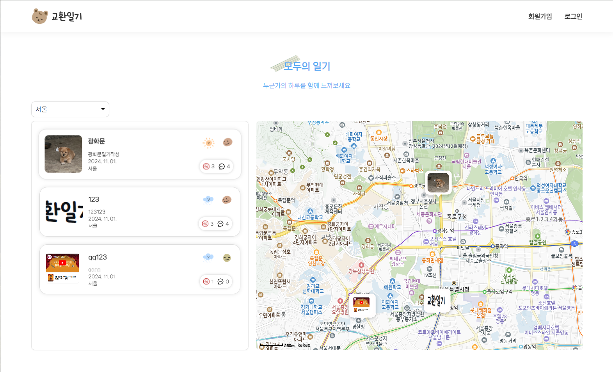
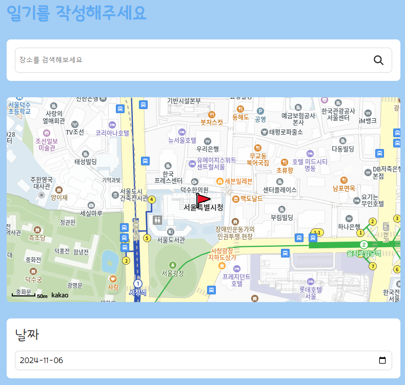
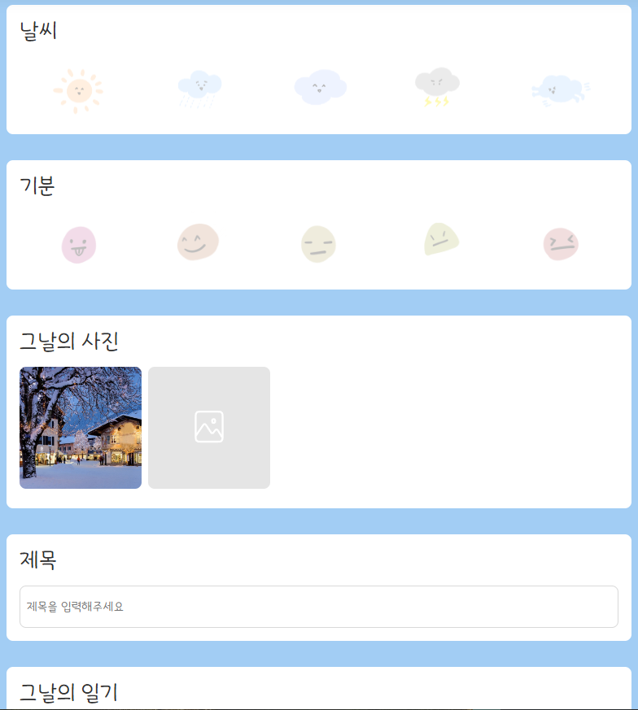
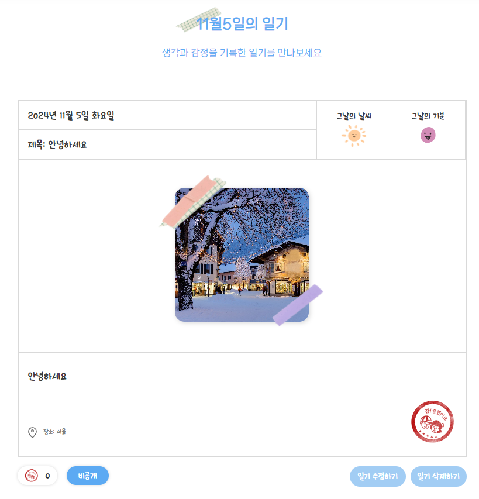

# 교환일기 프로젝트
<a href="https://nfe-1-1-3-diaryhub.vercel.app/" style="text-decoration: none;">메인 서비스 주소</a>
<br>
<br>

## 0. 메인기능
**교환일기 (Diary Hub)**는 사용자가 찍은 **사진과 글**을 통해 소중한 순간을 기록하고, 쉽게 돌아볼 수 있게 도와줍니다.

작성된 일기는 **공개 또는 비공개**로 설정할 수 있어, 다른 사람들과 공유하거나 개인적으로 보관할 수 있습니다.

**지도와 검색 기능**을 통해 기록한 일기를 손쉽게 찾아보며 새로운 여행지를 발견하거나 다양한 경험을 확인할 수 있습니다.

**직관적인 인터페이스**로 간편하게 일기를 작성하고 위치를 지정해 생생한 기록을 남길 수 있어, 여행의 순간을 더 특별하게 만들어줍니다.
<br>
<br>

## 1. UI
### 메인


### 일기작성
<div style="display: flex">
  
  
</div>

### 일기보기

<br>
<br>

## 2. 기술스택
<div style="display: flex; justify-content: center; align-items: center;">
  <a href="https://ko.react.dev/learn" target="_blank"></a>
  <a href="https://www.typescriptlang.org/" target="_blank"></a>
  <a href="https://vanilla-extract.style/" target="_blank"></a>
  <a href="https://www.kakaocorp.com/page/service/service/KakaoMap" target="_blank"></a> 
  <a href="https://kenwheeler.github.io/slick/" target="_blank"></a> 
  <a href="https://eslint.org/" target="_blank"></a> 
</div>
<br>
<br>

## 3. 설치방법
```javascript
https://github.com/jinhyukSeo777/NFE-1-1-3-diaryhub.git
npm install
npm run start
```
<br>


