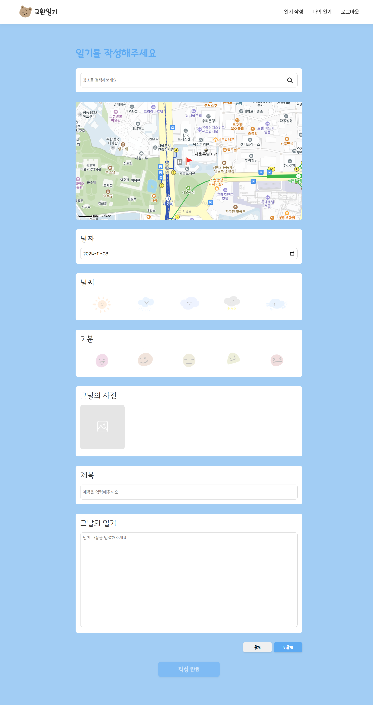

# 📓 교환일기

### 일상을 기록하고, 감정을 공유하며, 사람들과 소통할 수 있는 위치 기반 일기 플랫폼

<a href="https://nfe-1-1-3-diaryhub.vercel.app/" style="text-decoration: none;">교환일기 웹사이트</a>

<a href="https://github.com/prgrms-fe-devcourse/NFE-1-1-3-diaryhub-backend" style="text-decoration: none;">백엔드 github</a>
<br>
<br>

## 🙌 프로젝트 소개

개인의 소중한 기억을 간직하고, 공개와 비공개 설정을 통해 선택적으로 공유할 수 있어 SNS 또는 나만의 일기장으로써 일상의 순간들을 보다 의미 있게 기록할 수 있습니다.

기존의 일반 일기 사이트와 다르게 지도 기반 일기로 장소에 대한 경험을 사람들과 이야기를 공유할 수 있습니다.
<br>
<br>

## 🔽 목차

- [프로젝트 소개](#-프로젝트-소개)
- [개발 기간](#-개발-기간)
- [프로젝트 팀원](#-프로젝트-팀원)
- [기술 스택](#️-기술-스택)
- [주요 기능](#주요-기능)
- [설치방법](#-설치방법)
<br>

## 📆 개발 기간

- 기획기간 : 2024.10.17 ~ 2024.10.24
- 개발기간 : 2024.10.25 ~ 2024.11.06
<br>

## 🧑‍💻 프로젝트 팀원

| **Frontend** | **Frontend** | **Frontend** | **Frontend** | **Backend** |
| --- | --- | --- | --- | --- |
| [서진혁](https://github.com/jinhyukSeo777) | [김주리](https://github.com/thsk3) | [안종인](https://github.com/ahnjongin) | [이가영](https://github.com/Ga-Zero) | [김재환](https://github.com/Sunami97) |
<br>
<br>

## 🛠️ 기술 스택

### **Front-End**
 


<br>
### **Back-End**
    
<br>
<br>

## 💡 주요 기능

### 메인
- 전체, 현재 위치, 지역별 옵션을 기준으로 필터링된 공개 일기 리스트를 확인할 수 있습니다.
- 카카오 지도 api 활용해 지도 위에 이미지 마커가 찍혀 일기의 장소를 확인할 수 있습니다.

<br>

### 회원가입
- 사용자 이름, 아이디, 비밀번호를 입력 받아 중복된 이름, 아이디인지 확인 후 가입합니다.

<br>

### 로그인
- 가입된 사용자 정보에서 입력 받은 이름과 비밀번호가 일치할 경우 로그인합니다.

<br>

### 일기 작성
- 일기 작성 페이지에서 주소와 일기 제목, 내용, 날씨, 감정, 사진을 입력 후 비공개, 공개 옵션을 선택해 작성합니다.

<br>

### 일기 상세
- 그림일기 형태의 상세 내용을 확인할 수 있으며, 다른사람의 일기에 좋아요와 유사한 기능인 참잘했어요 스탬프를 찍을 수 있습니다.
- 댓글을 통해서 SNS와 유사하게 이용자들 간 소통을 할 수 있습니다.

<br>

### 나의 일기
- 사용자가 작성한 일기 목록(공개, 비공개)을 확인할 수 있습니다.

<br>

### 다른 사람의 일기
- 다른 작성자의 일기 목록(공개)을 확인할 수 있습니다.

<br>
<br>


## 👀 설치방법

```bash
# 레포지토리 클론
git clone https://github.com/jinhyukSeo777/NFE-1-1-3-diaryhub.git

# 프로젝트 폴더로 이동
cd NFE-1-1-3-diaryhub

# 패키지 설치
npm install

# 프로젝트 실행
npm run start
```

